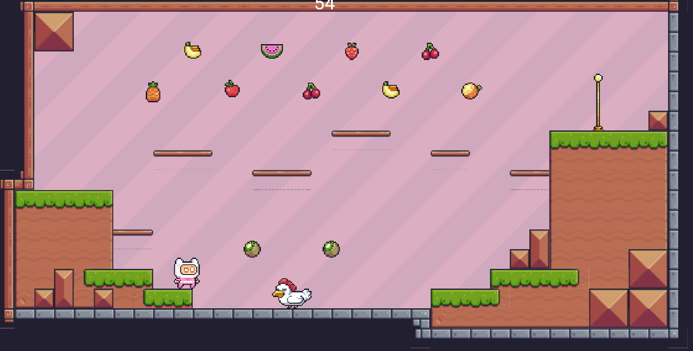
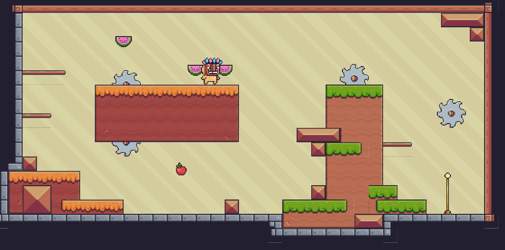
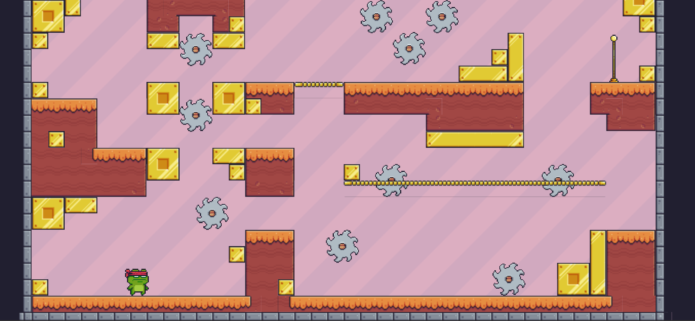

# Pixel Adventure

A 2D platformer mobile game developed using Flutter and the Flame game engine.

## Project Overview

This project was created to explore mobile game development using Flutter while implementing game programming fundamentals such as physics, collision systems and animation handling.

The game is inspired by classic pixel-art platformers.

## Features

- Character movement system
- Jump mechanics
- Collision detection
- Level progression
- Sprite animations

## Technologies Used

- Dart
- Flutter
- Flame Engine
- Git
- Mobile development

## What I worked on

I developed the core gameplay systems including:

- Player controller
- Physics and collisions
- Animation management
- UI integration
- Level management
- Debugging and optimization

## Challenges

Main technical challenges included:

- Implementing smooth collision detection
- Optimizing game performance on mobile devices
- Managing sprite animations efficiently

## What I learned

This project helped me improve my skills in:

- Game architecture
- Mobile development
- Object oriented programming
- Performance optimization
- Problem solving

## Screenshots

| Gameplay 1 | Gameplay 2 | Gameplay 3 |
|------------|------------|------------|
|  |  |  |
